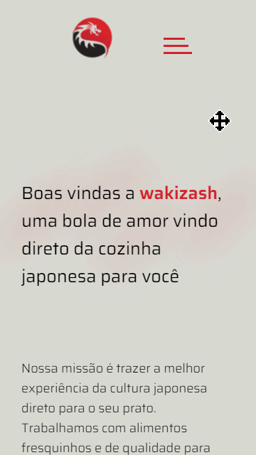

<h1 align="center">
    
    Wakizash
</h1>

<h4 align="center">
    Projeto desenvolvido com a finalidade de aprimorar as habilidades de um site responsivo. 
</h4>
 

    
    
    

 

### 🚀 Tecnologias

 Projeto desenvolvido com as seguintes tecnologias: 

- [Sass](https://sass-lang.com/)
- [SVGInject](https://github.com/iconfu/svg-inject)
- Html 5

 

### 🔖 Layout

 Para visualizar o layout, faça seu cadastro em: 

- [Figma](https://www.figma.com/)

 Depois é só acessar o projeto por aqui: 

- [Wakizash](https://www.figma.com/file/W8XrOqa2r0mJL3I2YksWwv/Wakizash?node-id=0%3A1)

 

### Vercel
Aqui você pode visualizar o projeto, é só clicar em:
[Wakizash](https://wakizash.vercel.app/)

 

### 🚧 Features Futuros:
✔️ Fazer uma página para o carrinho de compras
✔️ Fazer uma página para o Menu
✔️ Lógica para fazer os produtos irem para o carrinho de compras e salvá-los com LocalStorage
- Fazer um menu interativo para mostrar a navegação na parte responsiva: Menu, Minha Conta e Carrinho

 

### 📝 Licença
O projeto contém a licença MIT. Para mais informações acesse [LICENSE](https://github.com/tamirysnogueira/wakizash/blob/master/LICENSE).

 

Feito com 💖 por TamirysNogueira. [Get in Touch!](https://www.linkedin.com/in/tamirys-nogueira-346958205/)